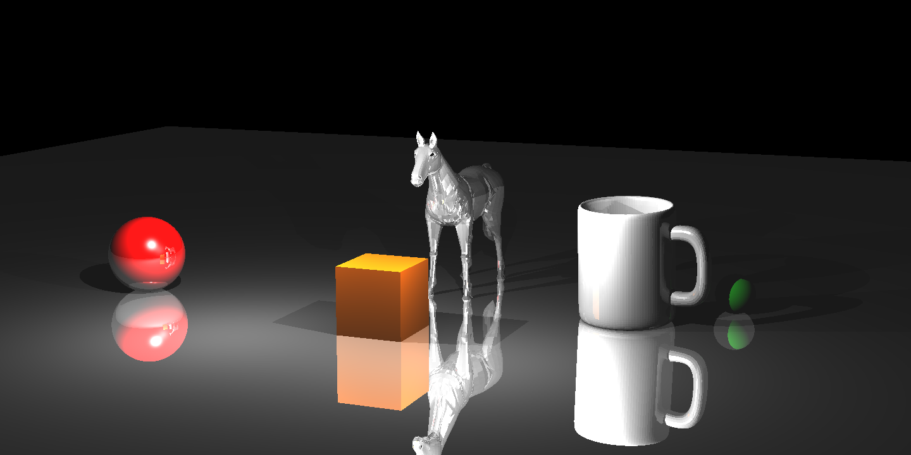
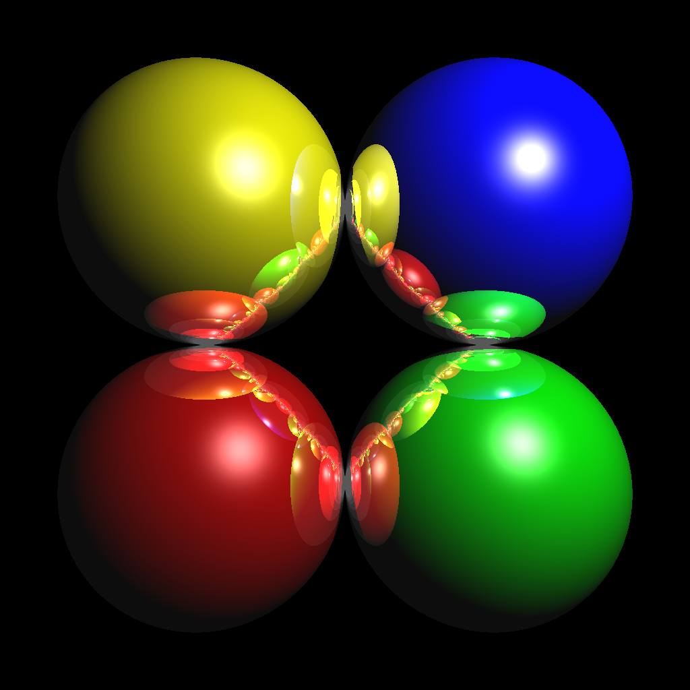

## Ray Tracer
This is the first assignment of CENG477 Computer Graphics Course.

In this assignment a basic ray tracer implemented that
simulates the propagation of light in real world.

Ray tracing is a fundamental rendering algorithm. It is commonly used for animations and architectural simulations, in which the quality of the created images is more important than the time
it takes to create them.

Some example outputs. (I manually converted them from ppm to png)

