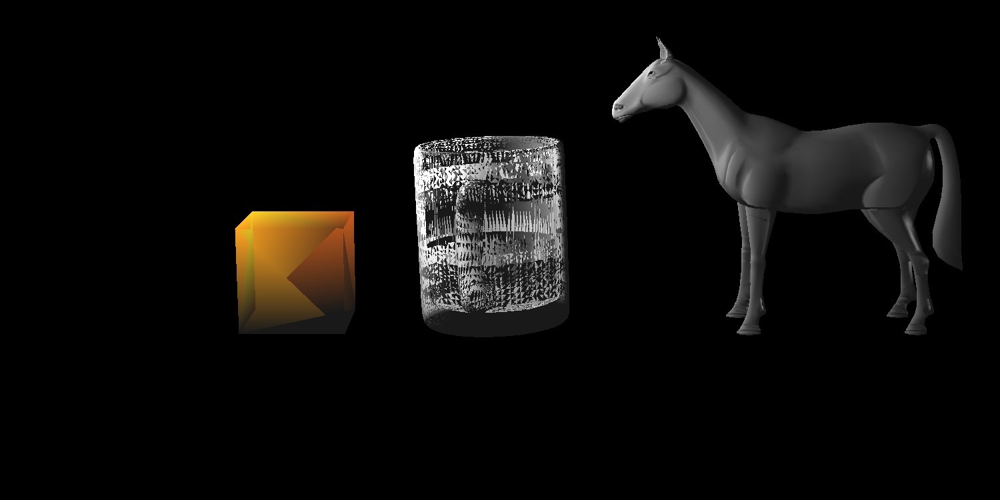
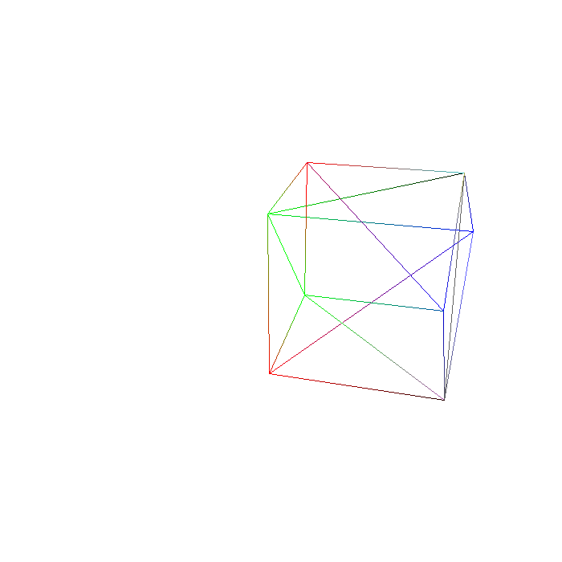
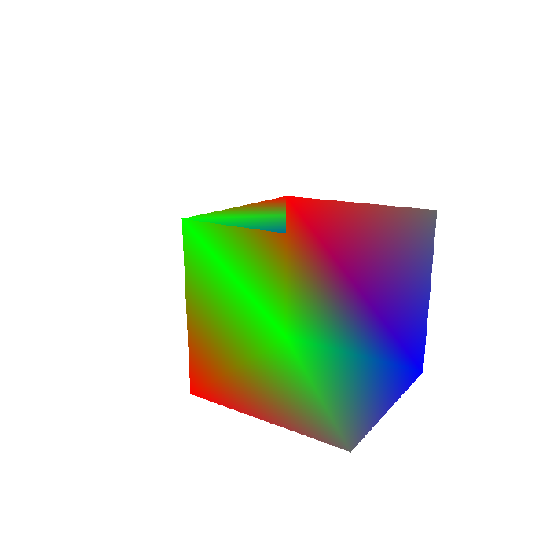

## Forward Rendering Pipeline
This is the second assignment of CENG477 Computer Graphics Course.

In this assignment, Modeling Transformation, Viewing Transformation, and Rasterization stages of the Forward Rendering Pipeline are implemented. 

Liang-Barsky clipping algorithm is used.

Some example outputs. (I manually converted them from ppm to png)

